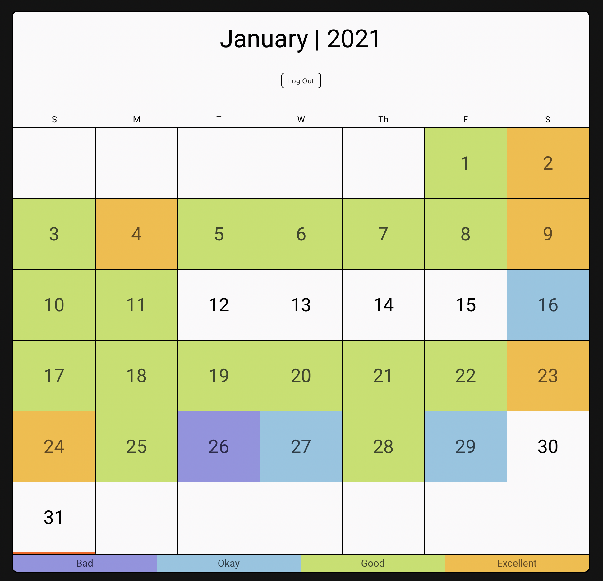
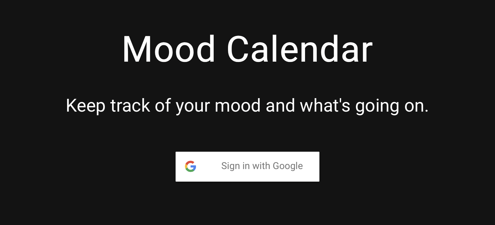
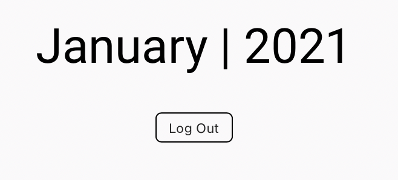
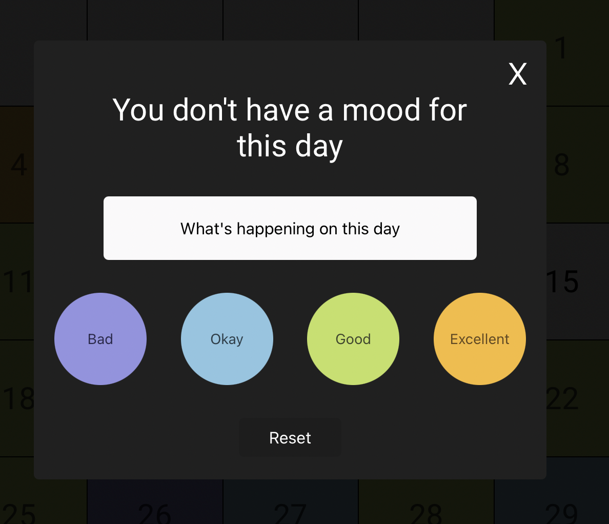
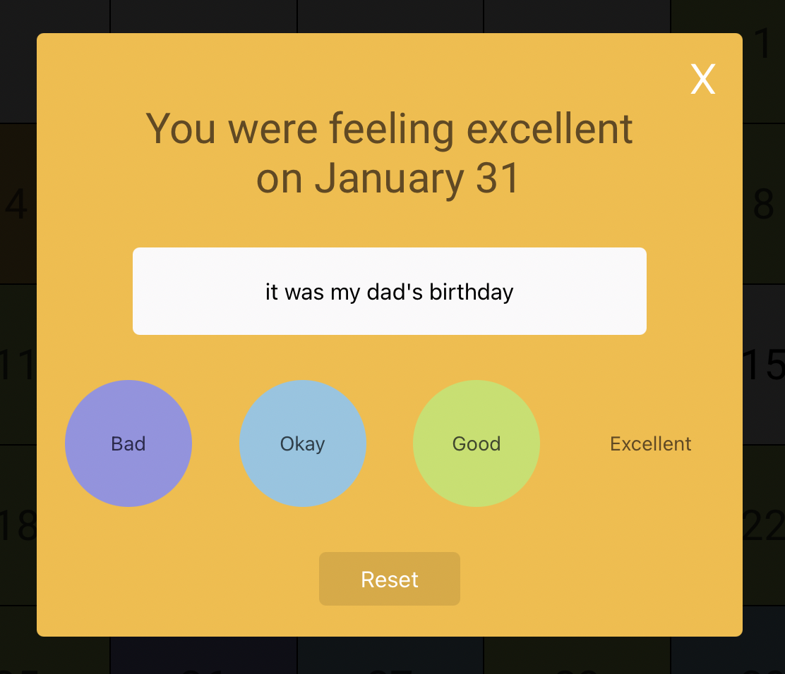

See deployed version here ! [Mood Calendar on Github Pages](https://intrvertmichael.github.io/ts-mood-calendar/)

# Mood Calendar
Mood Calendar is a basic calendar/journal to keep track of your mood. With this project I built transferable skills that I could use in future projects such as familiarity with React, Redux, and Firebase. I made this project originally in Javascript then remade it in Typescript in order to make the project more stable and to learn about this new language. This was my first time using Redux after completing the Modern React with Redux Udemy Course.

| |  |
|---|---|

## Technology Used

For this project I used React in order to create the layout and calendar, Redux to manage the global state, and Firebase as the db to store the information.

## Features

### Auth

Mood Calendar uses Google Auth in order to enter the app and save your moods, notes, and calendars. The Google Auth was implemented through firebase which returns a token that is used in order to keep track of your account.

### Date

Once you are logged in you are presented with a calendar that was made from scratch. The squares of the calendar were made with a loop that creates a component for each day. At the top of the calendar is the current viewed month which will turn into a drop down menu if you have been recording your mood for more then one month. You also see the logout button which allows you to exit the app.

### Modal

The modal is how you enter the information into the app. When you click on a day the modal pops up letting you know wether or not you have a mood for that day. You can then either enter your mood or change the mood that was entered before. There is also a button which you can click in order to enter a note for that day about what was going on. On the day the thing is happening it is easy to remember what is going on but as the day's go by you may see a pattern of a certain mood and not recall why you were feeling that way. The modal is also where you can clear a day if you want to just start over.

